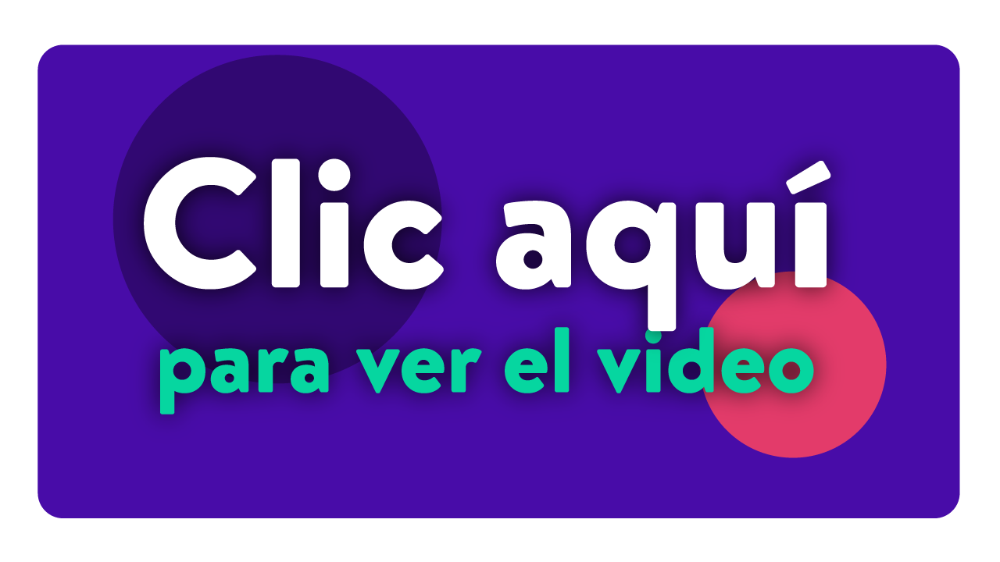
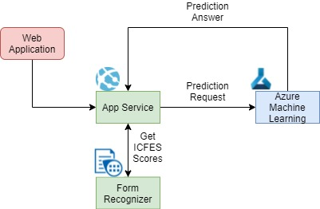

## Video
[](https://1drv.ms/v/s!Aji73RMdY35c0BvkfetJivsXnxhh)


## Website
http://23.96.36.59:443 (currently down)

# Career Recommendation

When it comes to choosing a career path, senior high-school students struggle to make a decision. The purpose of this app is to help such students select a career track by providing a match-based scored recommendation of academic and professional routes, promoting the development of the government-aided quality educational system by reducing the student dropout. Recommendations are based on the results of the Colombian standardized Saber 11 examination (which is similar to SAT [Scholastic Assessment Test] scores in the U.S.), and how other students with similar characteristics (demographic, socio-economic, family information) performed in their undergraduate tests and the Colombian standardized Saber Pro exam (which is similar to GRE -Graduate Record Examination- scores in the U.S.). Collected information was bundled with their career choice and the recommendation system was developed using Machine Learning and Deep Learning techniques, ROC (Receiver operating characteristic) curve was computed for each career and found on average the AUC (Area under the ROC Curve) score was 0.86 despite the high variability between them, in addition a business metric was build and evaluated.

# How to use the App

To know your recommended careers, you just need to introduce your ICFES scores (with values from 0 to 100) as the app ask for it. These scores are: language, math, humanities, science and english, then, press the submit button. The app will redirect you to the results page, in there would be three careers that the app recommended you, and for each career, you can check for the universities that offer it. Additionally, if you are previously interested in a specific career, in the bottom of the results page would be a selector menu, where you can search for the career you want, see how much affinity you have with it, and the universities that offer it.

# Tools
## Adobe illustrator: used for graphic design
## HTML,CSS and React: used for the pages layout
## Javascript: used for the logical functions

## Running App
```
$ cd frontend
$ npm install
$ npm audit fix
$ npm install sweetalert
$ npm run build
$ npm run start
```
## Deployment


